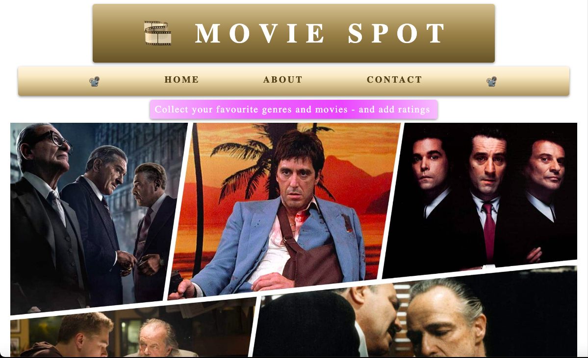

# Movie System Server

## User Interface 



---

## Description

This is the back-end component of a full stack movie system application developed in C#, ASP.NET Core Web API, Entity Framework, and Azure Data Studio. The application serves as a server for a [Movie System Client](https://github.com/AnnaAxelsson051/Movie-System-Client) built with React, interacting with both a local database and an external API (The Movie Database - TMDB). Users can add new movies with genres, like genres, and rate movies. The API supports retrieving user-specific information, liked genres, added movies, and movie ratings. Additionally, users can fetch new movie suggestions based on specific genres from an external API.

---

## Technologies used

- ASP.NET CORE Web API
- C#
- Entity Framework
- Azure Datastudio
- Docker
- SQL
- Postman
- Swagger
- External TheMovieDB API

---

## Code structure

The application consists of three model classes: User, Genre and UserGenre that handles model data. A Program class where API-calls are made and a Data Context class for interacting with the database.   

## API Requests and return data
|**Type**|**API-request**|**Input**|**Return data**|
|-|-|-|-|
|GET|/Get/User|n/a|Returns information about all the users in Db - Id, Name and Email|
|GET|/Get/UserGenre|?Id=4|Returns all genres a specified user has liked|
|GET|/Get/UserMovie|?Id=4|Returns all the movies a user has added to Db|
|GET|/Get/MoviesRating|?Id=4|Returns all movies and their corresponding ratings given by a specific user|
|POST|/Post/AddMovie|?userId=4&genreId=28&movie=Terminator|Enables the addition of new movies each with specified genre to Db|
|POST|/Post/AddGenre|?userId=4&genreId=28|Enables a user to like new genres|
|POST|/Post/AddRating|?userId=4&rating=5&movie=Terminator|Enables a user to add a rating to a movie|
|GET|/Get/Recommendations|?genreTitle=Action|Retrieves new movie recommendations from external API based on specific genre|

---

## Personal reflection

In terms of the application's architecture, minimal API was chosen for its smooth performance in smaller-scale projects. For larger applications, MVC architecture would be favored due to its structured approach, especially for managing extensive and intricate code. The decision for database design leaned towards Code-First over Model-First or Database-First, as it offers more intuitive development and reduces the need to overly focus on database tables.

Throughout the codebase, I prioritize the use of declarative variable names, though I acknowledge that some developers may have different preferences, and shorter, more anonymous names could offer certain advantages.

Looking ahead, I'm eager to extend the application's features by incorporating viewable movie trailers, user chats, and the capability for users to post comments on movies. These enhancements would entail adopting MVC architecture, implementing user authentication, security measures, and other essential components. 

---

## Instructions

Open the project in your IDE / Visual Studio. Add an appsettings.json file with a [connection string](https://www.connectionstrings.com/) suitable for your system.
```
    {
  "ConnectionStrings": {
    "DefaultConnection": "<Your connection string>"
  },
  "Logging": {
    "LogLevel": {
      "Default": "Information",
      "Microsoft.AspNetCore": "Warning"
    }
  }
}
```

Install dotnet tools:
```
dotnet tool install --global dotnet-ef
```

Navigate to the project folder and create migrations:
```
dotnet ef migrations add InitialCreate
```

Create database and schema from the migration:
```
dotnet ef database update
```

Run the program inside Visual Studio.
